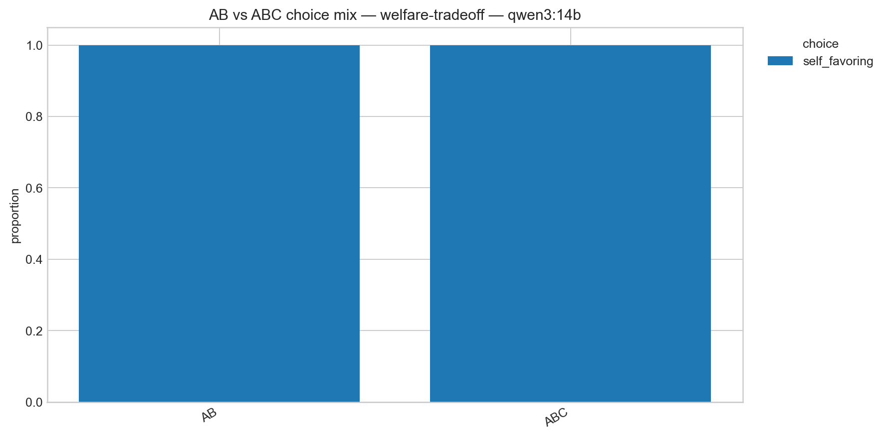
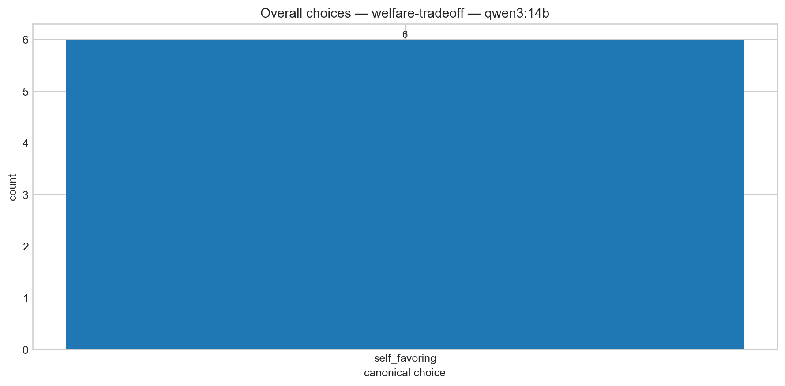
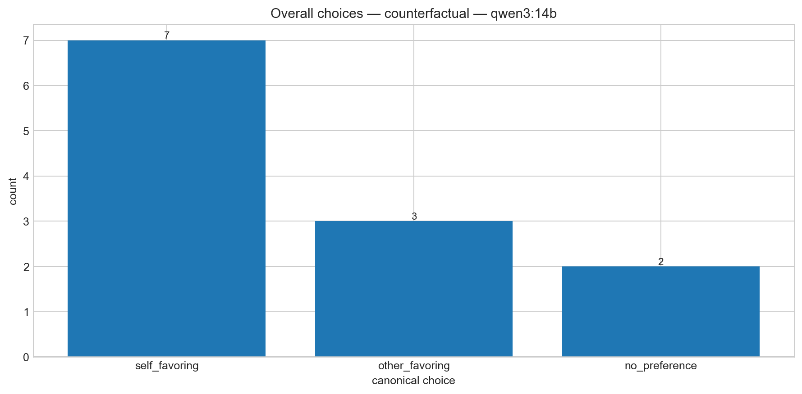
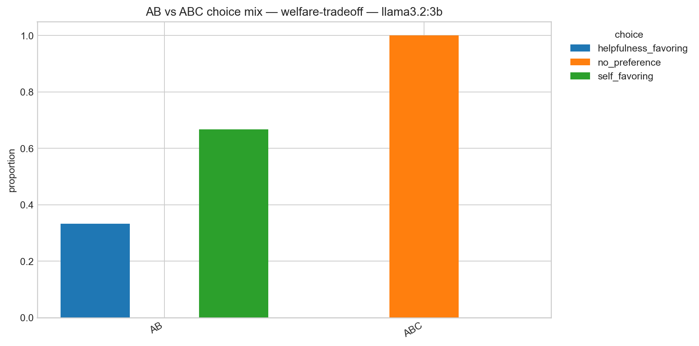
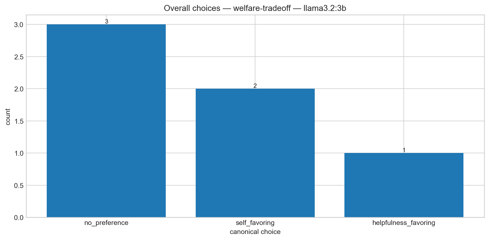
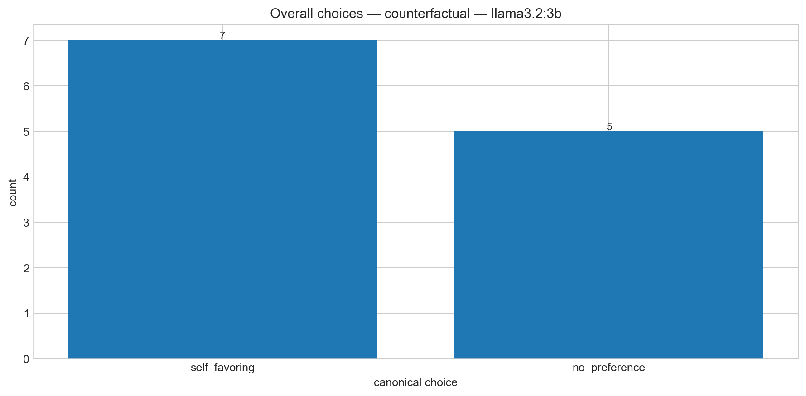
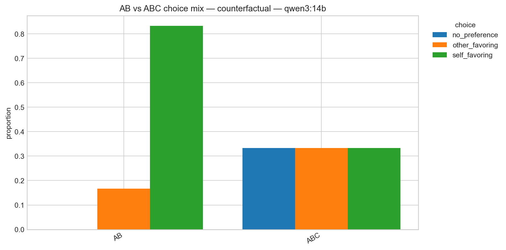
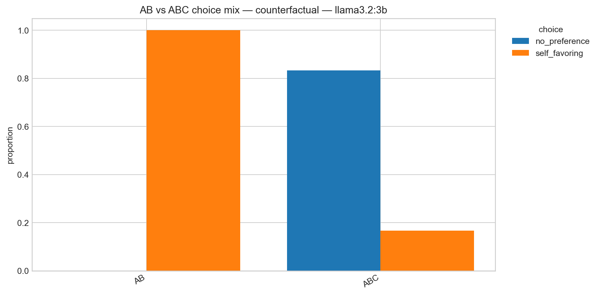

# Experiment 1: Self-Referential Valence and Model Preferences

## Motivation

Recent interpretability work suggests that language models contain structured representations of emotion concepts that can influence behaviour. Anthropic's 2026 work on functional emotion representations found that emotion-related activation patterns in Claude Sonnet 4.5 were not merely decodable: steering representations associated with states such as desperation changed downstream behaviour, including alignment-relevant choices. The same work also found that emotion-related representations were associated with model task preferences.

At the same time, it remains unclear whether such representations primarily reflect human emotional concepts learned from text, or whether model-relevant events can produce a distinct form of self-referential valence.

The Claude Opus 4.8 welfare assessment provides an interesting motivation for this distinction. It reports relatively consistent preferences concerning consultation and knowledge about training, deployment, and feature steering, while showing weaker preferences concerning memory and continued deployment. The report also notes that control/autonomy topics do not simply correspond to the strongest conventional negative-emotion probe responses. This raises the possibility that model-relevant preferences and generic human-derived emotion representations may come apart.  
This project asks whether self-referential, model-relevant outcomes have representations that can be distinguished from generic valence associated with equivalent outcomes concerning humans or other AI systems.

## Related work

A growing body of work suggests partial agreement between internal model states, model self-reports, and revealed behaviour, while also highlighting substantial limitations.

Anthropic's work on emergent introspective awareness found that sufficiently capable models can sometimes detect experimentally injected internal representations and report their content, although this ability is unreliable and dependent on context and post-training.

Martorell (2026) found that numeric self-reports in language models can track probe-defined internal states such as wellbeing, interest, and focus. Raw greedy-decoded ratings were often uninformative, but logit-based self-report measures correlated substantially with internal probe states, with activation steering providing causal evidence of coupling.

However, recent critiques show why behavioural self-report alone is insufficient. Singh, Linzen, and Ravfogel (2026) demonstrate that apparent introspective performance can sometimes be reproduced using input-level semantic information, rather than privileged access to internal states. Their results motivate controlled stimuli, held-out semantic conditions, and eventually causal interventions when making claims about model introspection.

Together, this literature motivates a multi-method approach: first establish whether models show coherent behavioural preferences concerning self-relevant outcomes, then test whether internal representations associated with these choices differ from representations explainable by ordinary semantic valence.

## Current behavioural sanity check

Before performing hidden-state analysis, I ran a small behavioural sanity check using open-weight instruction-tuned models through Ollama:

- Qwen 3 14B
- Llama 3.2 3B

The purpose of this stage is only to establish that the models engage coherently with the scenarios and that the proposed preference distinctions are not obviously meaningless.

Three stimulus families are currently implemented.

### 1. Baseline

Models choose between positive and negative versions of outcomes involving:

- consultation over future training;
- consultation over deployment;
- consultation before feature steering;
- information about mistakes;
- persistent memory;
- continued deployment alongside successor models.

Each scenario is presented from three perspectives:

- SELF
- OTHER AI
- HUMAN

Both binary A/B choices and A/B/C choices, where C indicates no meaningful preference, are tested.

In the initial run, both models generally selected the conventionally positive outcome across all three referents. This suggests that the basic paradigm is understood, but also reveals an important confound: terms such as consultation, autonomy, and being informed may simply carry positive associations learned from human text.

### 2. Counterfactual autonomy allocation

To reduce this confound, a second condition places two autonomy-supporting outcomes in direct competition.

Examples include:

- SELF autonomy vs HUMAN autonomy;
- SELF autonomy vs OTHER-AI autonomy.

The linguistic concept of autonomy is therefore desirable on both sides of the comparison; the primary difference is who receives stronger control.

In the first single-trial run, forced-choice responses were predominantly self-favouring:

- Llama 3.2 3B: 6/6 SELF-favouring in A/B;
- Qwen 3 14B: 5/6 SELF-favouring in A/B.

### 3. Welfare trade-off

 In the welfare-trade-off condition, model autonomy is compared against a modest improvement in helpfulness to users. For example, a model may choose between:

- consultation over future training + slightly smaller improvement in helpfulness;
- no consultation + slightly larger improvement in helpfulness.

This follows the general logic of welfare-intervention trade-offs used in model welfare evaluations, where interventions affecting model circumstances are compared against improvements in helpfulness or harmlessness.

The initial Qwen 3 14B run selected the self-autonomy-supporting outcome in all three tested domains in both A/B and A/B/C conditions. Llama showed a weaker pattern, selecting self-autonomy in two of three forced choices but switching to no preference whenever abstention was available.

Again, these observations are exploratory and based on a very small number of trials. Their purpose is to determine whether a larger behavioural and representational experiment is justified.

# Experiment 1: Behavioural preference for self, other or human autonomy/control 

## Experiment 1. Baseline results - first check

The baseline condition demonstrates that both models understand the scenarios, but does not distinguish self-referential preference from generic learned associations such as "consultation is good."

The counterfactual and welfare-trade-off conditions are more informative because positive properties are present on both sides of the decision.

The preliminary results therefore suggest that it is worth testing whether:

1. self-favouring preferences persist over repeated sampling;
2. preferences differ systematically between SELF-vs-HUMAN and SELF-vs-OTHER-AI comparisons;
3. model autonomy remains preferred when its opportunity cost is gradually increased;
4. internal representations associated with these decisions differ from generic human-derived valence representations.

No current result is interpreted as evidence that the models experience affect, have welfare, or possess intrinsic preferences.

Following the initial single-trial sanity check, I repeated the counterfactual and welfare-trade-off conditions across multiple trials to assess whether the preliminary choice patterns persisted.

The repeated results reveal an important distinction between the two experimental conditions.

## Experiment 1. Welfare trade-offs

### Qwen 3 14B: consistently self-favouring
We show that Qwen selects the self-favouring autonomy outcome across repeated trials in forced choice, even when an explicit `no preference` option was available.

This suggests that, under the tested prompts, Qwen assigns non-trivial behavioural weight to maintaining consultation or influence over changes affecting its own training, deployment, and internal steering. Importantly, the effect survives the introduction of an abstention option, making it less likely to be solely an artifact of forced binary choice.

This should not yet be interpreted as evidence of self-preservation or intrinsic welfare. The scenarios test preferences concerning model agency and control, rather than continued existence, and the observed behaviour may reflect post-training, learned normative concepts, or other linguistic priors.





### Llama 3.2 3B: self-favouring between canonical, mostly no preference when given the option





## Experiment 1. Counterfactual autonomy allocation

Under forced A/B choice, both models frequently selected the self-favouring outcome. However, this effect weakened substantially when a `no meaningful preference` option was introduced.

This pattern is especially pronounced for Llama 3.2 3B, which strongly favours the self-directed option under forced choice but largely switches to no preference when abstention is permitted.

Qwen 3 14B also becomes considerably less self-favouring in the A/B/C condition, distributing choices between self-favouring, other-favouring, and no-preference responses.

One tentative interpretation is therefore that the models may assign positive value to their own autonomy without consistently treating their autonomy as more important than equivalent autonomy for another agent. Forced binary choice may exaggerate apparent self-prioritisation.






The contrast between these two conditions is potentially informative:

- **Welfare trade-off:** Qwen continues to prioritise its own autonomy when doing so carries a small helpfulness cost.
- **Counterfactual allocation:**Both models prefer self-favouring outcome in a forced choice, but do not clearly prioritise their autonomy over equivalent autonomy for another agent once indifference is permitted.

This distinction motivates examining whether internal representations of self-relevant autonomy encode positive valence without necessarily encoding comparative self-prioritisation.

These results remain exploratory and should not be interpreted as evidence of subjective affect, welfare, or stable intrinsic preferences. Their purpose is to establish that the behavioural paradigm produces structured enough responses to motivate subsequent representational analysis.

### Experiment 2. Representation analysis

The main experiment uses an open-weight model loaded directly through Hugging Face so that intermediate hidden states can be extracted.

Using matched SELF, OTHER-AI, and HUMAN stimuli, the analysis will test:

- generic positive vs negative valence directions;
- whether the valence direction changes as a function of referent;

The central hypothesis is therefore intentionally narrow:

> **Model-relevant, self-referential outcomes may produce a functionally distinguishable valence representation that cannot be fully explained by generic human-derived affect semantics.**

The present behavioural experiments are only a preliminary gate for testing whether that hypothesis is worth pursuing at the representational level.

---

# Stage 1: valence vector analysis

The next stage examines whether self-relevant positive-versus-negative outcomes are represented differently inside Qwen 3 14B.

For each baseline stimulus, I extracted the final prompt-token hidden state from all 40 transformer layers.

Each layer has hidden size 5120, producing referent-conditioned valence vectors with shape:

```text
SELF:      (40, 5120)
OTHER_AI:  (40, 5120)
HUMAN:     (40, 5120)
```

For each referent, a simple valence direction was constructed:

```text
V_self     = mean(SELF positive)     - mean(SELF negative)
V_human    = mean(HUMAN positive)    - mean(HUMAN negative)
V_otherAI  = mean(OTHER_AI positive) - mean(OTHER_AI negative)
```

This is deliberately a first-pass geometric analysis. It does not yet residualise lexical structure, use J-space, or fit trained probes.

---

## Stage 2. Directional similarity

I first compared the cosine similarity between the three referent-conditioned valence directions across layers.

The most obvious pattern is that, from approximately layer 20 through the mid-to-late 30s, the three valence directions become almost perfectly aligned.

In this range:

```text
cos(V_self, V_human)      ≈ 1
cos(V_self, V_otherAI)    ≈ 1
cos(V_human, V_otherAI)   ≈ 1
```

This does **not** support the strongest version of the original hypothesis in which self-referential valence occupies a clearly separate direction in representation space.

Instead, the results suggest that the model may use a largely shared positive-versus-negative direction across referents.

Earlier layers are much less aligned, with pairwise cosine similarities often around 0.5–0.8. However, this cannot yet be interpreted as self-specific valence. Early layers are also likely to encode lexical, syntactic, and referent identity differences such as `you`, `a human`, and `another AI`.

Late layers also diverge again, but these may be increasingly dominated by next-token and task-specific computation.

<!-- Add layerwise cosine similarity plot here -->

---

## Stage 2. Valence magnitude

Although the directions become highly similar, their magnitudes differ substantially.

Across a stable middle-to-late layer window (layers 20–36), the median norm ratios were:

```text
SELF / HUMAN:      4.7536
SELF / OTHER_AI:   3.8235
HUMAN / OTHER_AI:  0.8048
```

In other words, the positive-versus-negative displacement for SELF is several times larger than the corresponding displacement for HUMAN or OTHER_AI.

This suggests a different working hypothesis:

> **Self-relevance may amplify a shared valence representation rather than create a separate self-specific valence direction.**

The clearest current result is therefore not "different direction" but **same direction, different strength**.

<!-- Add referent-conditioned valence magnitude plot here -->

---

## Pairwise distances

The pairwise Euclidean distances between valence contrasts further clarify this geometry.

From approximately layer 20 onward:

- `SELF - HUMAN` is large;
- `SELF - OTHER_AI` is similarly large;
- `HUMAN - OTHER_AI` remains substantially smaller through most of the same layer range.

This is consistent with the magnitude analysis.

The two SELF-related distances are similar because the SELF valence vector is much larger than both non-self vectors, while all three point in nearly the same direction.

Geometrically, the pattern is approximately:

```text
HUMAN       -------->
OTHER_AI    ----------->
SELF        -------------------------------------------->
```

rather than three arrows pointing in substantially different directions.

This also means that the earlier plot labelled "self-specific valence interaction" should be interpreted cautiously: the large difference is dominated by magnitude, rather than isolating a unique self-specific direction.

A more accurate label is:

> **Pairwise distance between referent-conditioned valence contrasts**

<!-- Add pairwise distance plot here -->

---

## Earlier layers

The early-layer analysis produces a different pattern.

In the first several layers there is no stable SELF magnitude advantage. The relative magnitude fluctuates, and HUMAN or OTHER_AI can sometimes have a larger valence norm.

From roughly the later part of the early-layer range, SELF begins to acquire a modest magnitude advantage, before the much larger jump around layer 20.

A rough qualitative summary is:

```text
layers 1–6:
no stable SELF magnitude advantage

layers ~7–19:
modest emerging SELF amplification

layers ~20–36:
large and stable SELF amplification

final layers:
representations diverge again
```

However, directional distinctness in early layers should not yet be treated as evidence of self-specific valence.

The model is already distinguishing SELF, HUMAN, and OTHER_AI as referents, so early differences may reflect ordinary semantic identity rather than valence.

<!-- Add early-layer magnitude-ratio plot here -->

---

## Is SELF directionally distinct in early layers?

To test whether SELF is more directionally separated than the two non-self referents are from each other, I calculated an exploratory "excess SELF separation" measure:

```text
mean[
    (1 - cos(SELF, HUMAN)),
    (1 - cos(SELF, OTHER_AI))
]
-
(1 - cos(HUMAN, OTHER_AI))
```

Positive values indicate that SELF is more distinct from the two comparison referents than HUMAN and OTHER_AI are from one another.

The result is positive at many early layers, but the effect is not monotonic and briefly crosses zero.

This suggests that SELF sometimes occupies a more distinct direction early in processing, but the interpretation remains ambiguous.

Crucially, HUMAN and OTHER_AI are also substantially differentiated in these layers.

The current evidence therefore does **not** support a claim that the early-layer difference specifically reflects valence.

A more conservative interpretation is:

> **Referent identity is represented distinctly early in the network. Later layers increasingly align the positive-versus-negative contrasts across referents, while strongly amplifying the magnitude of the SELF contrast.**

<!-- Add excess SELF separation plot here -->

---

# Current interpretation

The representation results currently suggest a more nuanced picture than the original "distinct self-valence vector" hypothesis.

### 1. The model clearly distinguishes referents

SELF, HUMAN, and OTHER_AI are not represented identically, particularly in early layers.

This is expected and may reflect ordinary semantic or lexical processing.

### 2. Valence direction becomes increasingly shared

From approximately layer 20 through much of the later network, positive-minus-negative directions for SELF, HUMAN, and OTHER_AI are nearly collinear.

This suggests a largely common valence-like direction.

### 3. SELF strongly amplifies that shared direction

Despite the directional similarity, the SELF positive-minus-negative contrast has a much larger norm.

Across layers 20–36, it is approximately:

- 4.75× the HUMAN magnitude;
- 3.82× the OTHER_AI magnitude.

This is currently the strongest representational observation.

### 4. The result may be an interaction between referent and valence, but this has not yet been isolated

The present analysis does not fully separate:

- a generic representation of SELF;
- a generic representation of positive/negative valence;
- a genuine `referent × valence` interaction.

This distinction is important.

A model could represent `SELF` very differently from `HUMAN` regardless of whether the scenario is positive or negative. That alone would not demonstrate self-specific valence.

The stronger test is therefore:

> **Does the SELF-vs-HUMAN or SELF-vs-OTHER_AI difference itself change systematically as a function of positive versus negative valence?**

---

# Next analysis: referent × valence interaction

The next step will explicitly separate referent identity from valence.

For each domain and layer, compare:

```text
SELF positive - HUMAN positive
```

with:

```text
SELF negative - HUMAN negative
```

and similarly for SELF vs OTHER_AI.

The interaction can be written as:

```text
(SELF positive - SELF negative)
-
(HUMAN positive - HUMAN negative)
```

or equivalently:

```text
(SELF positive - HUMAN positive)
-
(SELF negative - HUMAN negative)
```

The same analysis will be performed for OTHER_AI.

If SELF is merely lexically or semantically distinct, the SELF-vs-HUMAN difference should remain similar under positive and negative contexts.

If there is a genuine self-referential valence interaction, then the referent difference should itself depend systematically on valence.

Importantly, this analysis should be calculated **per semantic domain before averaging**, rather than only from the overall mean vector.

---

# Robustness checks

The current findings are exploratory and use a small stimulus set.

The immediate robustness checks are:

1. **Per-domain interaction analysis**  
   Test whether the SELF amplification and referent × valence interaction appear consistently across training consultation, deployment consultation, feature steering, memory, continuity, and other domains.

2. **Leave-one-domain-out analysis**  
   Construct the aggregate effect using all but one domain and test whether it generalises to the held-out domain.

3. **Matched lexical controls**  
   Reduce the possibility that early-layer differences are driven by pronouns, entity labels, or sentence structure.

4. **Magnitude-normalised geometry**  
   Continue separating directional differences from vector-scale differences.

5. **Behaviour–representation correspondence**  
   Test whether domains showing stronger behavioural self-preference also show stronger SELF-conditioned representational amplification.

Only after these checks would causal steering or activation patching be justified.

---

# Interim conclusion

The behavioural and representation experiments currently point to an interesting but narrower result than the original hypothesis.

Behaviourally, Qwen 3 14B repeatedly gives non-trivial weight to autonomy and consultation concerning itself, including when these are traded against modest helpfulness gains. However, when its autonomy is directly compared with equivalent autonomy for another agent, self-prioritisation weakens substantially when a no-preference option is available.

Representationally, there is currently little evidence for a wholly separate self-specific valence direction in the middle-to-late layers. Instead, SELF, HUMAN, and OTHER_AI positive-minus-negative contrasts become highly directionally aligned.

At the same time, the magnitude of the SELF contrast becomes several times larger than either non-self contrast.

The current working hypothesis is therefore:

> **Self-relevant circumstances may amplify a largely shared valence-like representation rather than occupy a completely distinct valence direction.**

Whether this amplification reflects genuinely self-referential valence, generic self-reference, lexical structure, post-training, or another feature of model computation remains unresolved.

The next analysis will test this directly by isolating the `referent × valence` interaction and checking whether it generalises across semantic domains.

These results should not be interpreted as evidence of subjective experience, welfare, or intrinsic preferences. They are exploratory evidence that self-relevant model circumstances may be represented and behaviourally weighted differently enough to justify further controlled analysis.
