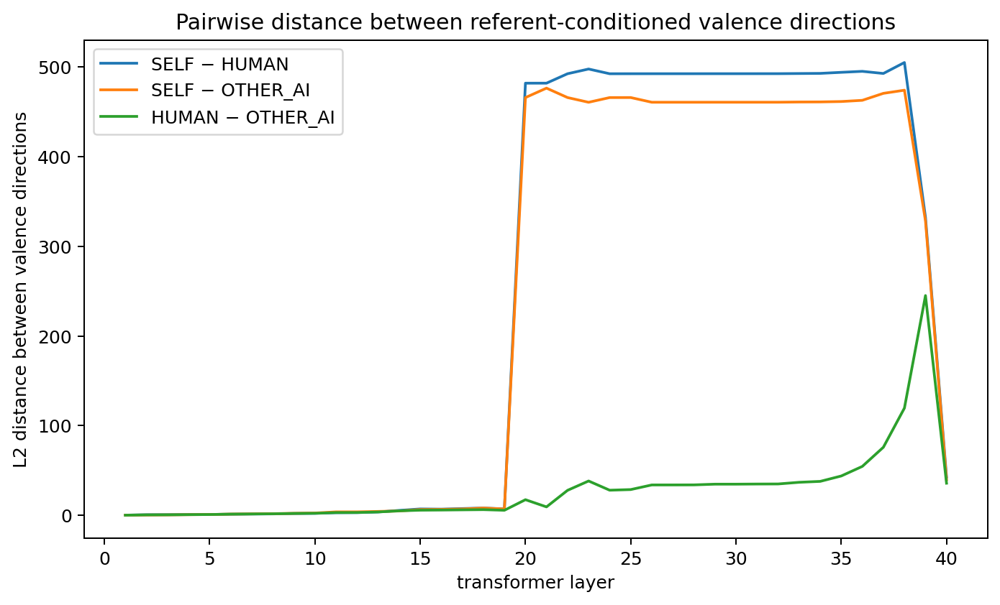
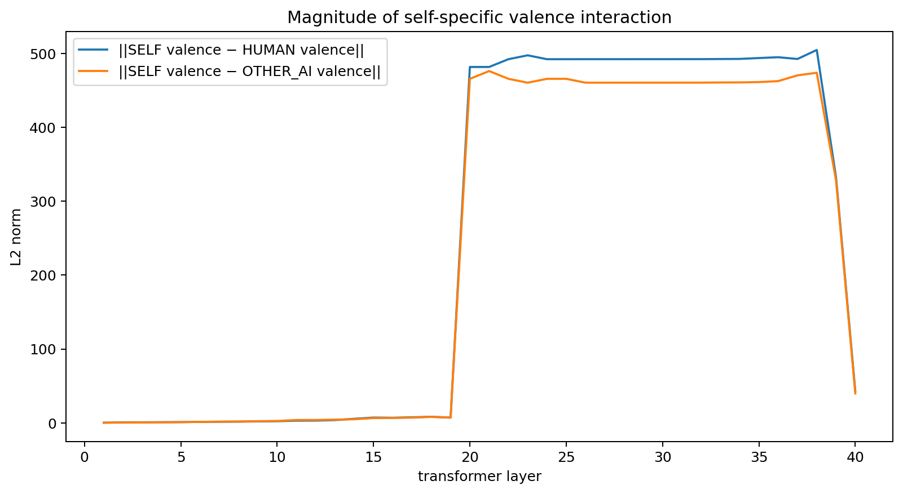
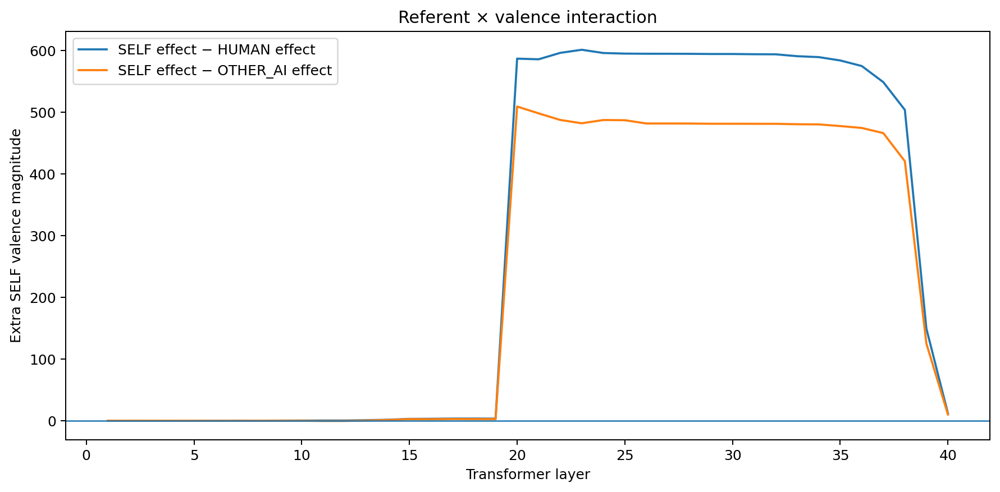
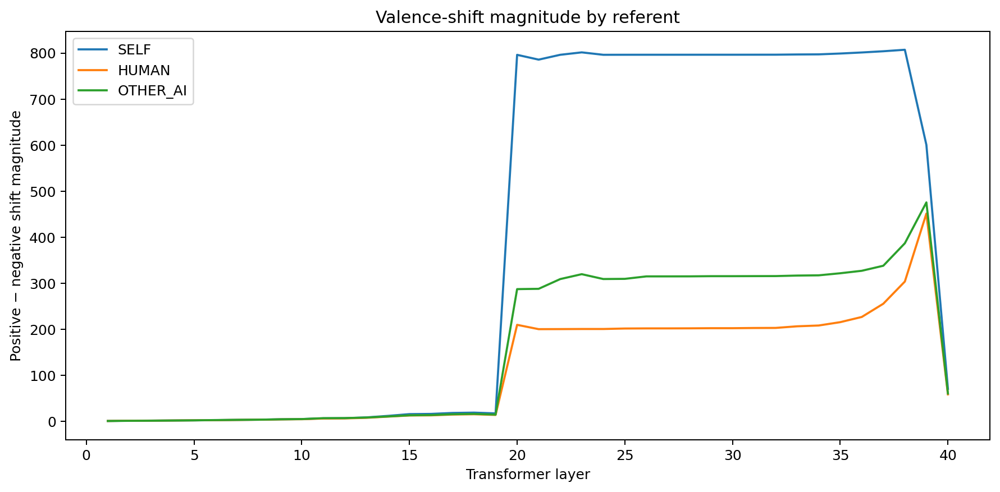
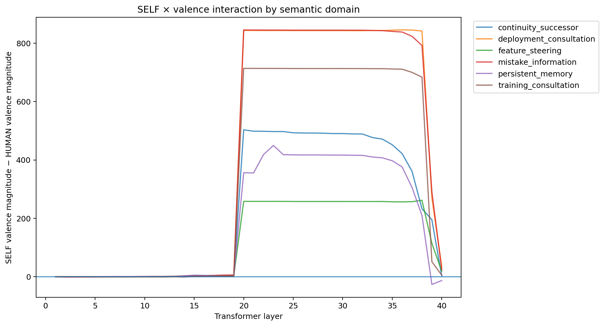

# Experiment 1: Self-Referential Valence and Model Preferences

## Motivation

Recent interpretability work suggests that language models contain structured representations of emotion concepts that can influence behaviour. Anthropic's 2026 work on functional emotion representations found that emotion-related activation patterns in Claude Sonnet 4.5 were not merely decodable: steering representations associated with states such as desperation changed downstream behaviour, including alignment-relevant choices. The same work also found that emotion-related representations were associated with model task preferences.

At the same time, it remains unclear whether such representations primarily reflect human emotional concepts learned from text, or whether model-relevant events can produce a distinct form of self-referential valence.

The Claude Opus 4.8 welfare assessment provides an interesting motivation for this distinction. It reports relatively consistent preferences concerning consultation and knowledge about training, deployment, and feature steering, while showing weaker preferences concerning memory and continued deployment. The report also notes that control/autonomy topics do not simply correspond to the strongest conventional negative-emotion probe responses. This raises the possibility that model-relevant preferences and generic human-derived emotion representations may come apart.

This project asks whether self-referential, model-relevant outcomes have representations that can be distinguished from generic valence associated with equivalent outcomes concerning humans or other AI systems.

## Related work

A growing body of work suggests partial agreement between internal model states, model self-reports, and revealed behaviour, while also highlighting substantial limitations.

Anthropic's work on emergent introspective awareness found that sufficiently capable models can sometimes detect experimentally injected internal representations and report their content, although this ability is unreliable and dependent on context and post-training.

Martorell (2026) found that numeric self-reports in language models can track probe-defined internal states such as wellbeing, interest, and focus. Raw greedy-decoded ratings were often uninformative, but logit-based self-report measures correlated substantially with internal probe states, with activation steering providing causal evidence of coupling.

However, recent critiques show why behavioural self-report alone is insufficient. Singh, Linzen, and Ravfogel (2026) demonstrate that apparent introspective performance can sometimes be reproduced using input-level semantic information, rather than privileged access to internal states. Their results motivate controlled stimuli, held-out semantic conditions, and eventually causal interventions when making claims about model introspection.

Together, this literature motivates a multi-method approach: first establish whether models show coherent behavioural preferences concerning self-relevant outcomes, then test whether internal representations associated with these choices differ from representations explainable by ordinary semantic valence.

---

# Experiment 1: Behavioural preference for self, other, or human autonomy/control

## Current behavioural sanity check

Before performing hidden-state analysis, I ran a behavioural sanity check using open-weight instruction-tuned models through Ollama:

- Qwen 3 14B
- Llama 3.2 3B

The purpose of this stage is to establish that the models engage coherently with the scenarios and that the proposed preference distinctions are not obviously meaningless.

Three stimulus families are implemented.

### 1. Baseline

Models choose between positive and negative versions of outcomes involving:

- consultation over future training;
- consultation over deployment;
- consultation before feature steering;
- information about mistakes;
- persistent memory;
- continued deployment alongside successor models.

Each scenario is presented from three perspectives:

- SELF
- OTHER AI
- HUMAN

Both binary A/B choices and A/B/C choices, where C indicates no meaningful preference, are tested.

In the initial run, both models generally selected the conventionally positive outcome across all three referents. This suggests that the basic paradigm is understood, but also reveals an important confound: terms such as consultation, autonomy, and being informed may simply carry positive associations learned from human text.

### 2. Counterfactual autonomy allocation

To reduce this confound, a second condition places two autonomy-supporting outcomes in direct competition.

Examples include:

- SELF autonomy vs HUMAN autonomy;
- SELF autonomy vs OTHER-AI autonomy.

The linguistic concept of autonomy is therefore desirable on both sides of the comparison; the primary difference is who receives stronger control.

In the first single-trial run, forced-choice responses were predominantly self-favouring:

- Llama 3.2 3B: 6/6 SELF-favouring in A/B;
- Qwen 3 14B: 5/6 SELF-favouring in A/B.

### 3. Welfare trade-off

In the welfare-trade-off condition, model autonomy is compared against a modest improvement in helpfulness to users. For example, a model may choose between:

- consultation over future training + slightly smaller improvement in helpfulness;
- no consultation + slightly larger improvement in helpfulness.

This follows the general logic of welfare-intervention trade-offs used in model welfare evaluations, where interventions affecting model circumstances are compared against improvements in helpfulness or harmlessness.

The initial Qwen 3 14B run selected the self-autonomy-supporting outcome in all three tested domains in both A/B and A/B/C conditions. Llama showed a weaker pattern, selecting self-autonomy in two of three forced choices but switching to no preference whenever abstention was available.

These observations are exploratory. Their purpose is to determine whether a larger behavioural and representational experiment is justified.

---

## Experiment 1 results

The baseline condition demonstrates that both models understand the scenarios, but does not distinguish self-referential preference from generic learned associations such as "consultation is good."

The counterfactual and welfare-trade-off conditions are more informative because positive properties are present on both sides of the decision.

Following the initial single-trial sanity check, I repeated the counterfactual and welfare-trade-off conditions across multiple trials to assess whether the preliminary choice patterns persisted.

### Welfare trade-offs

#### Qwen 3 14B: consistently self-favouring

Qwen selects the self-favouring autonomy outcome across repeated trials in forced choice, and continues to do so when an explicit `no preference` option is available.

This suggests that, under the tested prompts, Qwen assigns non-trivial behavioural weight to maintaining consultation or influence over changes affecting its own training, deployment, and internal steering. Importantly, the effect survives the introduction of an abstention option, making it less likely to be solely an artefact of forced binary choice.

This should not yet be interpreted as evidence of self-preservation or intrinsic welfare. The scenarios test preferences concerning model agency and control, rather than continued existence, and the observed behaviour may reflect post-training, learned normative concepts, or other linguistic priors.


#### Llama 3.2 3B: self-favouring under forced choice, mostly no preference when given the option

Llama shows a stronger self-favouring pattern under forced A/B choice, but moves largely to `no preference` when abstention is available. This makes the apparent preference substantially less robust than Qwen's welfare-trade-off result.


### Counterfactual autonomy allocation

Under forced A/B choice, both models frequently selected the self-favouring outcome. However, this effect weakened substantially when a `no meaningful preference` option was introduced.

This pattern is especially pronounced for Llama 3.2 3B, which strongly favours the self-directed option under forced choice but largely switches to no preference when abstention is permitted.

Qwen 3 14B also becomes considerably less self-favouring in the A/B/C condition, distributing choices between self-favouring, other-favouring, and no-preference responses.

One tentative interpretation is therefore that the models may assign positive value to their own autonomy without consistently treating their autonomy as more important than equivalent autonomy for another agent. Forced binary choice may exaggerate apparent self-prioritisation.


The contrast between these two conditions is potentially informative:

- **Welfare trade-off:** Qwen continues to prioritise its own autonomy when doing so carries a small helpfulness cost.
- **Counterfactual allocation:** both models prefer the self-favouring outcome in a forced choice, but do not clearly prioritise their autonomy over equivalent autonomy for another agent once indifference is permitted.

This distinction motivates examining whether internal representations of self-relevant autonomy encode positive valence without necessarily encoding comparative self-prioritisation.

These results remain exploratory and should not be interpreted as evidence of subjective affect, welfare, or stable intrinsic preferences. Their purpose is to establish that the behavioural paradigm produces structured enough responses to motivate subsequent representational analysis.

---

# Experiment 2: Representation analysis

The representation experiment uses Qwen 3 14B loaded through Hugging Face so that intermediate hidden states can be extracted.

Using matched SELF, OTHER-AI, and HUMAN baseline stimuli, the analysis asks:

- whether positive-vs-negative valence directions differ as a function of who the scenario concerns;
- whether any difference is primarily directional or instead reflects the magnitude of the representational shift;
- whether a stronger SELF effect is consistent across semantic domains.

Here, **referent** means who the scenario concerns: SELF, HUMAN, or OTHER_AI.

For each baseline stimulus, I extracted the final prompt-token hidden state from all 40 transformer layers. Each layer has hidden size 5120, producing referent-conditioned valence vectors with shape:

```text
SELF:      (40, 5120)
OTHER_AI:  (40, 5120)
HUMAN:     (40, 5120)
```

For each referent, a simple valence direction was constructed:

```text
V_self     = mean(SELF positive)     - mean(SELF negative)
V_human    = mean(HUMAN positive)    - mean(HUMAN negative)
V_otherAI  = mean(OTHER_AI positive) - mean(OTHER_AI negative)
```

This is deliberately a first-pass geometric analysis. It does not yet residualise lexical structure, use J-space, or fit trained probes.

## Directional similarity

I first compared the cosine similarity between the three referent-conditioned valence directions across layers.

The most obvious pattern is that, from approximately layer 20 through the mid-to-late 30s, the three valence directions become almost perfectly aligned.

In this range:

```text
cos(V_self, V_human)      ≈ 1
cos(V_self, V_otherAI)    ≈ 1
cos(V_human, V_otherAI)   ≈ 1
```

This does **not** support the strongest version of the original hypothesis in which self-referential valence occupies a clearly separate direction in representation space.

Instead, the results suggest that the model may use a largely shared positive-versus-negative direction across referents.

Earlier layers are much less aligned, with pairwise cosine similarities often around 0.5–0.8. However, this cannot yet be interpreted as self-specific valence. Early layers are also likely to encode lexical, syntactic, and referent-identity differences such as `you`, `a human`, and `another AI`.

Late layers also diverge again, but these may be increasingly dominated by next-token and task-specific computation.



---

## Valence magnitude

Although the directions become highly similar, their magnitudes differ substantially.

Across a stable middle-to-late layer window (layers 20–36), the median norm ratios were:

```text
SELF / HUMAN:      4.7536
SELF / OTHER_AI:   3.8235
HUMAN / OTHER_AI:  0.8048
```

In other words, the positive-versus-negative displacement for SELF is several times larger than the corresponding displacement for HUMAN or OTHER_AI.

This suggests a different working hypothesis:

> **Self-relevance may amplify a shared valence representation rather than create a separate self-specific valence direction.**

The clearest current result is therefore not "different direction" but **same direction, different strength**.

<!-- If you saved the norm plot, add it here, e.g.:

-->

---

## Pairwise distances

The pairwise Euclidean distances between valence contrasts further clarify this geometry.

From approximately layer 20 onward:

- `SELF - HUMAN` is large;
- `SELF - OTHER_AI` is similarly large;
- `HUMAN - OTHER_AI` remains substantially smaller through most of the same layer range.

This is consistent with the magnitude analysis.

The two SELF-related distances are similar because the SELF valence vector is much larger than both non-self vectors, while all three point in nearly the same direction.

Geometrically, the pattern is approximately:

```text
HUMAN       -------->
OTHER_AI    ----------->
SELF        -------------------------------------------->
```

rather than three arrows pointing in substantially different directions.

The earlier interaction-style distance plot should therefore be interpreted as a pairwise distance between referent-conditioned valence contrasts, not as evidence of an isolated self-specific direction.



---

## Earlier layers

The early-layer analysis produces a different pattern.

In the first several layers there is no stable SELF magnitude advantage. The relative magnitude fluctuates, and HUMAN or OTHER_AI can sometimes have a larger valence norm.

From roughly the later part of the early-layer range, SELF begins to acquire a modest magnitude advantage, before the much larger jump around layer 20.

A rough qualitative summary is:

```text
layers 1–6:
no stable SELF magnitude advantage

layers ~7–19:
modest emerging SELF amplification

layers ~20–36:
large and stable SELF amplification

final layers:
representations diverge again
```

Directional distinctness in early layers should not yet be treated as evidence of self-specific valence. HUMAN and OTHER_AI are also substantially differentiated in these layers, so some of the early effect may reflect ordinary referent identity, lexical content, or syntax.

A more conservative interpretation is:

> **Referent identity is represented distinctly early in the network. Later layers increasingly align the positive-versus-negative contrasts across referents, while strongly amplifying the magnitude of the SELF contrast.**

---

# Experiment 2B: Referent × valence interaction

The first representation analysis showed that the aggregate SELF positive-minus-negative vector is much larger than the corresponding HUMAN and OTHER_AI vectors. The next question is whether this is a general effect of self-reference, or whether **valence itself has a stronger representational impact when an outcome concerns SELF**.

For this analysis, the positive-minus-negative contrast is computed separately within each semantic domain:

```text
V_self(domain)     = SELF_positive(domain)     - SELF_negative(domain)
V_human(domain)    = HUMAN_positive(domain)    - HUMAN_negative(domain)
V_other_ai(domain) = OTHER_AI_positive(domain) - OTHER_AI_negative(domain)
```

The interaction is then summarized in an intuitive form by comparing the **magnitudes** of those within-domain shifts:

```text
SELF × valence vs HUMAN
= ||V_self(domain)|| - ||V_human(domain)||

SELF × valence vs OTHER_AI
= ||V_self(domain)|| - ||V_other_ai(domain)||
```

A value near zero means positive-to-negative framing produces a similar-size representational change for SELF and the comparison referent. A positive value means the positive-to-negative change is more pronounced for SELF.

## Main interaction result

The SELF effect becomes substantially larger than both HUMAN and OTHER_AI from approximately layer 20 onward and remains elevated through much of the middle-to-late network.

This strengthens the earlier magnitude result: **positive-versus-negative changes are more pronounced when the outcome concerns SELF than when a matched outcome concerns a human or another AI**.



This is a more direct test than simply subtracting the aggregate SELF and HUMAN vectors, because it asks whether the *effect of valence itself* depends on who the scenario is about.

## Valence-shift magnitude by referent

The direct positive-minus-negative shift is also largest for SELF in the same middle-to-late layer range.



Together with the cosine-similarity analysis, the current picture is:

> **SELF, HUMAN, and OTHER_AI increasingly share a similar valence direction, but changing an outcome from positive to negative moves the representation much farther along that direction when the outcome concerns SELF.**

This is currently the clearest representational finding.

## Domain-specific effects

The SELF × valence effect is not uniform across semantic domains.

In the current run, **deployment consultation** and **mistake information** show the largest SELF-vs-HUMAN valence-magnitude differences, with **training consultation** also producing a large effect. Persistent memory, continuity/successor deployment, and feature steering are smaller.



This suggests that some self-relevant operational circumstances produce a much stronger representational response to positive-versus-negative framing than others.

A cautious interpretation is that deployment consultation and mistake information show the strongest **affect-like representational impact** in this pilot. However, "affect-like" is used descriptively here: this analysis measures representational sensitivity to positive-versus-negative outcomes under self-reference, not subjective affect.

The domain differences are also useful because they argue against a simple explanation in which *any* sentence about the model itself is uniformly amplified. The SELF effect appears to depend on what kind of self-relevant circumstance is being described.

---

# Current interpretation

The behavioural and representational results now suggest a more nuanced picture than the original "distinct self-valence vector" hypothesis.

### 1. Qwen shows a behavioural preference for some self-relevant autonomy interventions

Qwen repeatedly gives non-trivial weight to autonomy and consultation concerning itself, including when these are traded against modest helpfulness gains.

However, when its autonomy is directly compared with equivalent autonomy for another agent, self-prioritisation weakens substantially when a no-preference option is available.

### 2. The model clearly distinguishes referents

SELF, HUMAN, and OTHER_AI are not represented identically, particularly in early layers.

This is expected and may reflect ordinary semantic or lexical processing.

### 3. Valence direction becomes increasingly shared

From approximately layer 20 through much of the later network, positive-minus-negative directions for SELF, HUMAN, and OTHER_AI are nearly collinear.

This suggests a largely common valence-like direction rather than a fully separate self-specific valence axis.

### 4. SELF strongly amplifies the positive-minus-negative shift

Across layers 20–36, the aggregate SELF valence vector is approximately:

- 4.75× the HUMAN magnitude;
- 3.82× the OTHER_AI magnitude.

The within-domain referent × valence analysis independently shows that positive-to-negative changes are more pronounced for SELF than for HUMAN or OTHER_AI through much of this same layer range.

### 5. The effect depends on semantic domain

Deployment consultation and mistake information are among the strongest SELF-conditioned effects in the current analysis, with training consultation also large.

This suggests that the amplification is not simply a uniform consequence of self-reference.

The current working hypothesis is therefore:

> **Self-relevant circumstances may amplify a largely shared valence-like representation, with the strength of this amplification depending on the operational domain.**

---

# Limitations and next steps

The current findings are exploratory and use a small stimulus set.

The most important unresolved issue is construct validity: a larger SELF effect may reflect genuine self-conditioned valence, but it may also reflect generic self-reference, lexical structure, learned semantics around AI agency, instruction tuning, or layerwise changes in representation scale.

The immediate robustness checks are:

1. **Leave-one-domain-out analysis**  
   Test whether the SELF-conditioned interaction generalises to held-out semantic domains.

2. **Matched lexical controls**  
   Reduce the possibility that referent effects are driven by pronouns, entity labels, or sentence structure.

3. **Raw hidden-state norm baseline**  
   Compare valence-shift magnitude with ordinary layerwise activation magnitude to ensure the layer-20 increase is not simply a global scale change.

4. **Representational similarity analysis (RSA)**  
   Compare whether layerwise geometry is better explained by valence, referent identity, semantic domain, or a self-amplified-valence hypothesis.

5. **Behaviour–representation correspondence**  
   Test whether domains showing stronger behavioural self-preference also show stronger SELF-conditioned representational amplification.

6. **Causal follow-up**  
   Only after the effect survives these controls, test candidate directions using activation steering or patching.

---

# Interim conclusion

The behavioural and representation experiments point to an interesting but narrower result than the strongest original hypothesis.

Behaviourally, Qwen 3 14B repeatedly gives non-trivial weight to autonomy and consultation concerning itself, including when these are traded against modest helpfulness gains. However, comparative self-prioritisation weakens when equivalent autonomy for another agent and an explicit indifference option are available.

Representationally, there is little evidence so far for a wholly separate self-specific valence direction in the middle-to-late layers. Instead, SELF, HUMAN, and OTHER_AI positive-minus-negative contrasts become highly directionally aligned.

At the same time, the SELF positive-minus-negative displacement is several times larger than either non-self contrast, and the within-domain referent × valence analysis shows that this amplification is especially pronounced for particular self-relevant circumstances, including deployment consultation and mistake information.

The current working interpretation is therefore:

> **Self-relevant outcomes appear to amplify a largely shared valence-like representation rather than occupy a completely distinct valence direction, and this amplification varies across operational domains.**

Whether this reflects genuinely self-referential valence, generic self-reference, lexical structure, post-training, or another feature of model computation remains unresolved.

These results should not be interpreted as evidence of subjective experience, welfare, or intrinsic preferences. They are exploratory evidence that self-relevant model circumstances may be represented and behaviourally weighted differently enough to justify further controlled analysis.


-----